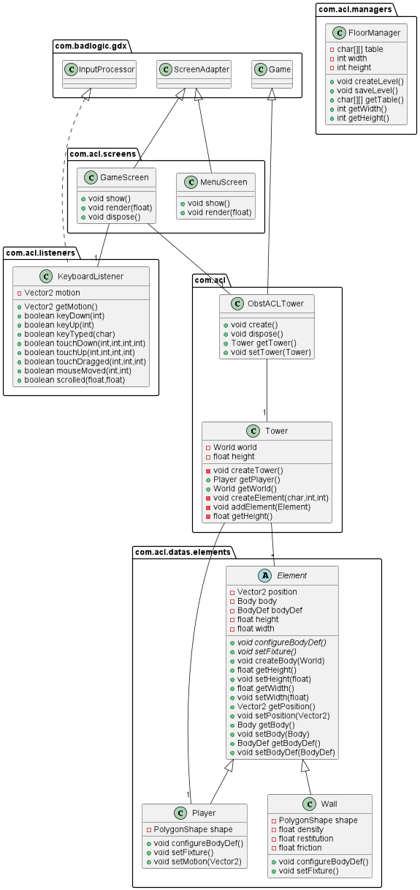

# ObstACL Tower

## Sommaire

1. <a href="#vision-du-jeu-final">Vision du jeu final</a>
2. <a href="#comment-compiler-et-exécuter-le-projet">Compilation & exécution du projet</a>
3. <a href="#sprint-0">Détails des sprints</a>
    1. <a href="#sprint-0">Sprint 0</a>
        1. <a href="#backlogs0">Backlogs</a>
        2. <a href="#liste0">Liste des tâches</a>
        3. <a href="#diagramme0">Diagramme(s)</a>
        4. <a href="#review0">Sprint Review</a>
        5. <a href="#retrospective0">Sprint Retrospective</a>
    2. <a href="#sprint-1">Sprint 1</a>
        1. Backlogs
        2. Liste des tâches
        3. Diagramme(s)
        4. Sprint Review
        5. Sprint Retrospective
    3. <a href="#sprint-2">Sprint 2</a>
        1. Backlogs
        2. Liste des tâches
        3. Diagramme(s)
        4. Sprint Review
        5. Sprint Retrospective
    4. <a href="#sprint-3">Sprint 3</a>
        1. Backlogs
        2. Liste des tâches
        3. Diagramme(s)
        4. Sprint Review
        5. Sprint Retrospective

-----

## Vision du jeu final

Notre jeu sera un rogue-lite basé sur un système de tour à gravir. Un héros pourra monter d’étages en étages, chaque
étage est un labyrinthe contenant des monstres et éventuellement des pièges. Certains étages auront des défis plus rares
ou compliqués sous forme d’événements spéciaux ou bien de boss. Au cours de son aventure, le héros va accumuler des
ressources qu’il pourra utiliser pour faciliter son exploration. Une fois mort, certaines ressources sont gardées même
après la mort et peuvent être utilisées pour obtenir des améliorations permanentes du héros.

-----

## Comment compiler et exécuter le projet

???

-----

## Sprint 0

### 
Backlogs

| Item                           | Estimate |
|--------------------------------|----------|
| Gestion du personnage          | 3        |
| Gestion de l'affichage de base | 3        |
| Création/Sauvegarde de niveau  | 3        |
| Menu du jeu                    | 3        |

### 
Liste des tâches

| Responsable            | Tâches                                                                                                                                                                                                                                                     | Temps estimé                                         | Temps réel |
|------------------------|------------------------------------------------------------------------------------------------------------------------------------------------------------------------------------------------------------------------------------------------------------|------------------------------------------------------|------------|
| IOPETI Hugo            | Récupération du projet GitHub et mise en place de l'environnement.  Lecture d'un fichier texte pour créer des étages.  Écriture dans un fichier texte pour sauvegarder des étages.  Tests des tâches des autres membres du groupe. | 30min  1h  45min  30min  |            |
| MATHIEU STEINBACH Hugo | Création du projet (LibGDX) et mise en place du GitHub.  Mise en place de la boucle de jeu.  Affichage des coordonnées du joueur suite aux déplacements.  Tests des tâches des autres membres du groupe.                           | 30min  1h30  30min  30min    |            |
| YVOZ Ludovic           | Récupération du projet GitHub et mise en place de l'environnement.  Création du personnage.  Création de l'écouteur clavier.  Tests des tâches des autres membres du groupe.                                                       | 30min  1h  1h  30min     |            |
| ZIMOL Guillaume        | Récupération du projet GitHub et mise en place de l'environnement.  Gestion d'un menu.  Tests des tâches des autres membres du groupe.                                                                                                     | 30min  45min  30min                  |            |

### Diagramme UML

### Review

/

### Restrospective

/

-----

