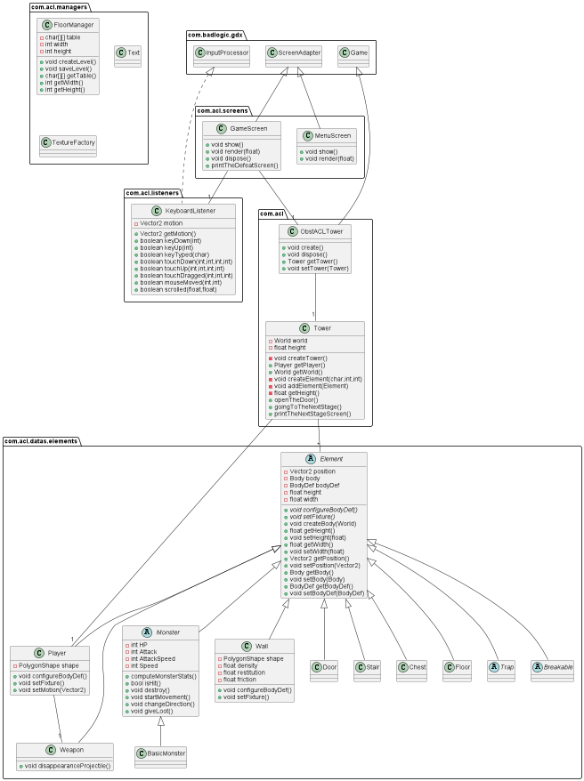
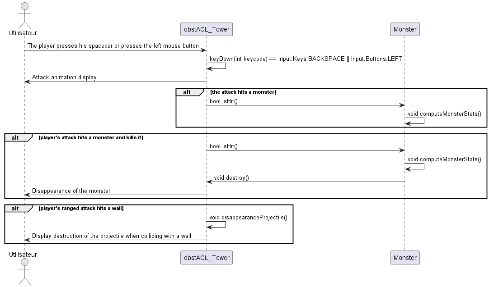
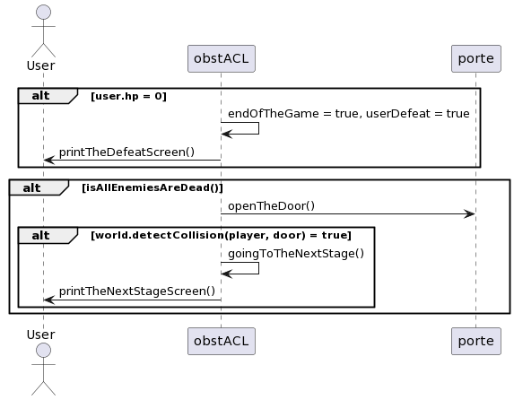
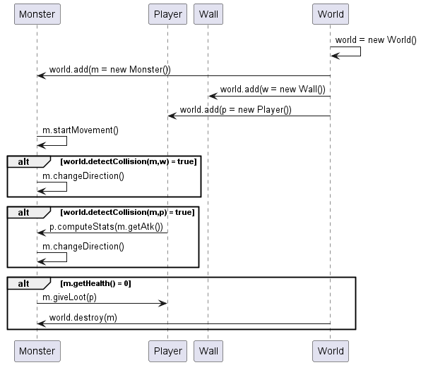

# ObstACL Tower

## Sommaire

1. <a href="#vision-du-jeu-final">Vision du jeu final</a>
2. <a href="#comment-compiler-et-exécuter-le-projet">Compilation & exécution du projet</a>
3. <a href="#sprint-0">Détails des sprints</a>
    1. <a href="#sprint-0">Sprint 0</a>
        1. <a href="#backlogs0">Backlogs</a>
        2. <a href="#liste0">Liste des tâches</a>
        3. <a href="#diagramme0">Diagramme(s)</a>
        4. <a href="#review0">Sprint Review</a>
        5. <a href="#retrospective0">Sprint Retrospective</a>
    2. <a href="#sprint-1">Sprint 1</a>
        1. <a href="#backlogs1">Backlogs
        2. <a href="#liste1">Liste des tâches
        3. <a href="#diagramme1">Diagramme(s)
        4. <a href="#review1">Sprint Review
        5. <a href="#retrospective1">Sprint Retrospective
    3. <a href="#sprint-2">Sprint 2</a>
        1. Backlogs
        2. Liste des tâches
        3. Diagramme(s)
        4. Sprint Review
        5. Sprint Retrospective
    4. <a href="#sprint-3">Sprint 3</a>
        1. Backlogs
        2. Liste des tâches
        3. Diagramme(s)
        4. Sprint Review
        5. Sprint Retrospective

-----

## Vision du jeu final

Notre jeu sera un rogue-lite basé sur un système de tour à gravir. Un héros pourra monter d’étages en étages, chaque
étage est un labyrinthe contenant des monstres et éventuellement des pièges. Certains étages auront des défis plus rares
ou compliqués sous forme d’événements spéciaux ou bien de boss. Au cours de son aventure, le héros va accumuler des
ressources qu’il pourra utiliser pour faciliter son exploration. Une fois mort, certaines ressources sont gardées même
après la mort et peuvent être utilisées pour obtenir des améliorations permanentes du héros.

-----

## Comment compiler et exécuter le projet

Premièrement, il faut avoir installer java :  
https://www.java.com/fr/download/  
Pour compiler le projet il vous faut un jdk java disponible ici :  
https://www.oracle.com/java/technologies/downloads/#jdk17  
Il faut ensuite exécuter cette commande à la racine du projet :
> ./gradlew desktop:dist

Puis pour lancer le jeu il faut exécuter la commande suivante toujours à la racine du projet :   
-Sur Windows/Linux : 
> java -XstartOnFirstThread -jar "./desktop/build/libs/desktop-1.0.jar"

-Sur MacOS
> java -XstartOnFirstThread -jar "./desktop/build/libs/desktop-1.0.jar"

-----

## Sprint 0

### 
Backlogs

| Item                           | Estimate |
|--------------------------------|----------|
| Gestion du personnage          | 3        |
| Gestion de l'affichage de base | 3        |
| Création/Sauvegarde de niveau  | 3        |
| Menu du jeu                    | 3        |

### 
Liste des tâches

| Responsable            | Tâches                                                                                                                                                                                                                                                     | Temps estimé                                         | Temps réel                                             |
|------------------------|------------------------------------------------------------------------------------------------------------------------------------------------------------------------------------------------------------------------------------------------------------|------------------------------------------------------|--------------------------------------------------------|
| IOPETI Hugo            | Récupération du projet GitHub et mise en place de l'environnement.  Lecture d'un fichier texte pour créer des étages.  Écriture dans un fichier texte pour sauvegarder des étages.  Tests des tâches des autres membres du groupe. | 30min  1h  45min  30min  | 30min  1h30  45min  30min  |
| MATHIEU STEINBACH Hugo | Création du projet (LibGDX) et mise en place du GitHub.  Mise en place de la boucle de jeu.  Affichage des coordonnées du joueur suite aux déplacements.  Tests des tâches des autres membres du groupe.                           | 30min  1h30  30min  30min    | 30min  1h30  45min  30min      |
| YVOZ Ludovic           | Récupération du projet GitHub et mise en place de l'environnement.  Création du personnage.  Création de l'écouteur clavier.  Tests des tâches des autres membres du groupe.                                                       | 30min  1h  1h  30min     | 30min  1h30  1h  30min     |
| ZIMOL Guillaume        | Récupération du projet GitHub et mise en place de l'environnement.  Gestion d'un menu.  Tests des tâches des autres membres du groupe.                                                                                                     | 30min  45min  30min                  | 30min  45min  30min                    |

### Diagramme UML

### Review

Nous avons réussi à implémenter le personnage dans le monde, le personnage se déplace lorsque l'utilisateur appuie sur
certaines touches du clavier.  
Lors de l'implémentation du joueur, la mise en place de ces données par rapport au monde (densité, ...) et le mouvement
ont été un peu plus complexes que prévu.  

Nous avons également mis en place la boucle de jeu, sans problème, mais un peu long, bien que la documentation soit
complète.  
Cependant l'affichage des coordonnées à également pris plus de temps que prévu à cause de la gestion des Body de
LibGDX.  

Nous avons réussi à lire un fichier texte permettant la création d'étages.
De cette façon, nous avons pu créer manuellement un étage dans un fichier texte (chaque caractère représentant un
élément du décor, actuellement, un seul élément existe : W, correspondant au mur).  
La lecture a pris plus de temps que prévu, pour cause, des problèmes dans le parsing du fichier ont persistés (problèmes
de lecture de chaîne de caractères, caractère invisible).  
Nous avons réussi à écrire un fichier texte permettant de sauvegarder des étages. De cette manière, le joueur pourra
dans le futur interagir avec les niveaux, en les sauvegardant et en ne perdant pas la progression de celui-ci.  

Environnement différent pour Guillaume, qui a amené à quelques problèmes sur sa machine, mais qui ont été réglé assez
rapidement.  
Plusieurs menus envisagés et différentes manière de les mettre en place, cependant nous avons décidé de faire le plus
simplement possible pour le moment.  

Aucun problème repéré lors des tests de nos fonctionnalités entre nous.

### Restrospective

Nous avons réussi à nous organiser très efficacement, ce qui a entraîné une facilité lors de l'écriture du code.  
L'ambiance au sein de l'équipe est très agréable et tous les membres de l'équipe sont ponctuels et prompts à aider s'il
y a un problème.  
L'entraide entre les différents membres du groupe a permis de résoudre les problèmes rencontrés.  
Comme étant le premier sprint, la plupart des fonctionnalités nécessitaient d'autres fonctionnalités, nous n'avons donc
pas pu tous travailler en simultané.  
La charge de travail pour le premier sprint et la mise en place du projet était suffisante.  
Nous prévoyons cependant d'investir plus de temps dans les prochains sprints, ainsi que de travailler en simultané sur
différents aspects de l'application, ce qui n'était pas possible pour ce premier sprint.  

-----

## Sprint 1

### 
Backlogs

| Item                                                                       | Estimate |
|----------------------------------------------------------------------------|----------|
| Implémenter la physique (collisions, friction)                             | 3        |
| Gérer l'affichage (niveau, joueur)                                         | 8        |
| Gérer les données du jeu et du joueur (score, argent, vie du joueur, etc.) | 8        |
| Gérer la création d'un niveau, avec de nouveaux éléments                   | 5        |
| Implémenter des monstres (déplacement, stats, vie, loots, mort)            | 8        |
| Gérer la fin d'un niveau/d'une partie                                      | 5        |
| Gérer l'attaque du joueur                                                  | 8        |

### 
Liste des tâches

| Responsable            | Tâches | Temps estimé                                         | Temps réel                                             |
|------------------------|--------|------------------------------------------------------|--------------------------------------------------------|
| IOPETI Hugo            |        |||
| MATHIEU STEINBACH Hugo |        |||
| YVOZ Ludovic           |        |||
| ZIMOL Guillaume        |        |||

### Diagramme UML

### Review

### Restrospective

