# ObstACL Tower

#### IOPETI Hugo, MATHIEU STEINBACH Hugo, YVOZ Ludovic & ZIMOL Guillaume

## Sommaire

1. <a href="#sprint-0">Sprint 0</a>
    1. <a href="#backlogs0">Backlogs</a>
    2. <a href="#liste0">Liste des tâches</a>
    3. <a href="#diagramme0">Diagramme(s)</a>
    4. <a href="#review0">Sprint Review</a>
    5. <a href="#retrospective0">Sprint Retrospective</a>
2. <a href="#sprint-1">Sprint 1</a>
    1. <a href="#backlogs1">Backlogs</a>
    2. <a href="#liste1">Liste des tâches</a>
    3. <a href="#diagramme1">Diagramme(s)</a>
    4. <a href="#review1">Sprint Review</a>
    5. <a href="#retrospective1">Sprint Retrospective</a>
3. <a href="#sprint-2">Sprint 2</a>
    1. <a href="#backlogs2">Backlogs</a>
    2. <a href="#liste2">Liste des tâches</a>
    3. <a href="#diagramme2">Diagramme(s)</a>
    4. <a href="#review2">Sprint Review</a>
    5. <a href="#retrospective2">Sprint Retrospective</a>
4. <a href="#sprint-3">Sprint 3</a>
   1. <a href="#backlogs3">Backlogs</a>
   2. <a href="#liste3">Liste des tâches</a>
   3. <a href="#diagramme3">Diagramme(s)</a>
   4. <a href="#review3">Sprint Review</a>
   5. <a href="#retrospective3">Sprint Retrospective</a>

---------------

## Sprint 0

### 
Backlogs

| Item                           | Estimate |
|--------------------------------|----------|
| Gestion du personnage          | 3        |
| Gestion de l'affichage de base | 3        |
| Création/Sauvegarde de niveau  | 3        |
| Menu du jeu                    | 3        |

### 
Liste des tâches

| Responsable            | Tâches                                                                                                                                                                                                                                                     | Temps estimé                                         | Temps réel                                             |
|------------------------|------------------------------------------------------------------------------------------------------------------------------------------------------------------------------------------------------------------------------------------------------------|------------------------------------------------------|--------------------------------------------------------|
| IOPETI Hugo            | Récupération du projet GitHub et mise en place de l'environnement.  Lecture d'un fichier texte pour créer des étages.  Écriture dans un fichier texte pour sauvegarder des étages.  Tests des tâches des autres membres du groupe. | 30min  1h  45min  30min  | 30min  1h30  45min  30min  |
| MATHIEU STEINBACH Hugo | Création du projet (LibGDX) et mise en place du GitHub.  Mise en place de la boucle de jeu.  Affichage des coordonnées du joueur suite aux déplacements.  Tests des tâches des autres membres du groupe.                           | 30min  1h30  30min  30min    | 30min  1h30  45min  30min      |
| YVOZ Ludovic           | Récupération du projet GitHub et mise en place de l'environnement.  Création du personnage.  Création de l'écouteur clavier.  Tests des tâches des autres membres du groupe.                                                       | 30min  1h  1h  30min     | 30min  1h30  1h  30min     |
| ZIMOL Guillaume        | Récupération du projet GitHub et mise en place de l'environnement.  Gestion d'un menu.  Tests des tâches des autres membres du groupe.                                                                                                     | 30min  45min  30min                  | 30min  45min  30min                    |

### Diagramme UML

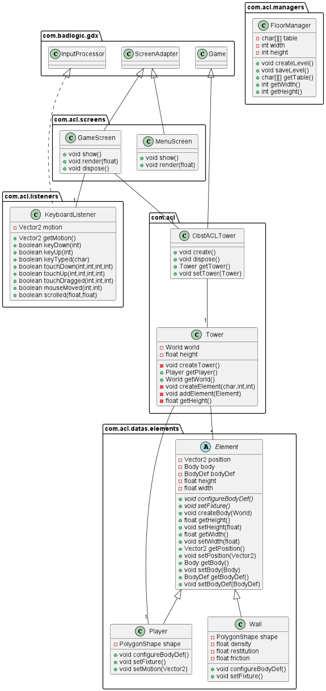

### Review

Nous avons réussi à implémenter le personnage dans le monde, le personnage se déplace lorsque l'utilisateur appuie sur
certaines touches du clavier.  
Lors de l'implémentation du joueur, la mise en place de ces données par rapport au monde (densité, ...) et le mouvement
ont été un peu plus complexes que prévu.  

Nous avons également mis en place la boucle de jeu, sans problème, mais un peu long, bien que la documentation soit
complète.  
Cependant l'affichage des coordonnées à également pris plus de temps que prévu à cause de la gestion des Body de
LibGDX.  

Nous avons réussi à lire un fichier texte permettant la création d'étages.
De cette façon, nous avons pu créer manuellement un étage dans un fichier texte (chaque caractère représentant un
élément du décor, actuellement, un seul élément existe : W, correspondant au mur).  
La lecture a pris plus de temps que prévu, pour cause, des problèmes dans le parsing du fichier ont persistés (problèmes
de lecture de chaîne de caractères, caractère invisible).  
Nous avons réussi à écrire un fichier texte permettant de sauvegarder des étages. De cette manière, le joueur pourra
dans le futur interagir avec les niveaux, en les sauvegardant et en ne perdant pas la progression de celui-ci.  

Environnement différent pour Guillaume, qui a amené à quelques problèmes sur sa machine, mais qui ont été réglé assez
rapidement.  
Plusieurs menus envisagés et différentes manière de les mettre en place, cependant nous avons décidé de faire le plus
simplement possible pour le moment.  

Aucun problème repéré lors des tests de nos fonctionnalités entre nous.

### Restrospective

Nous avons réussi à nous organiser très efficacement, ce qui a entraîné une facilité lors de l'écriture du code.  
L'ambiance au sein de l'équipe est très agréable et tous les membres de l'équipe sont ponctuels et prompts à aider s'il
y a un problème.  
L'entraide entre les différents membres du groupe a permis de résoudre les problèmes rencontrés.  
Comme étant le premier sprint, la plupart des fonctionnalités nécessitaient d'autres fonctionnalités, nous n'avons donc
pas pu tous travailler en simultané.  
La charge de travail pour le premier sprint et la mise en place du projet était suffisante.  
Nous prévoyons cependant d'investir plus de temps dans les prochains sprints, ainsi que de travailler en simultané sur
différents aspects de l'application, ce qui n'était pas possible pour ce premier sprint.  

-----

## Sprint 1

### 
Backlogs

| Item                                                                       | Estimate |
|----------------------------------------------------------------------------|----------|
| Implémenter la physique (collisions, friction)                             | 3        |
| Gérer l'affichage (niveau, joueur)                                         | 8        |
| Gérer les données du jeu et du joueur (score, argent, vie du joueur, etc.) | 8        |
| Gérer la création d'un niveau, avec de nouveaux éléments                   | 5        |
| Implémenter des monstres (déplacement, stats, vie, loots, mort)            | 8        |
| Gérer la fin d'un niveau/d'une partie                                      | 5        |
| Gérer l'attaque du joueur                                                  | 8        |

### 
Liste des tâches

| Responsable            | Tâches                                                                                                                                                                                                                                                                                                                                                                                                                                                          | Temps estimé                                                                    | Temps réel                                                                          |
|------------------------|-----------------------------------------------------------------------------------------------------------------------------------------------------------------------------------------------------------------------------------------------------------------------------------------------------------------------------------------------------------------------------------------------------------------------------------------------------------------|---------------------------------------------------------------------------------|-------------------------------------------------------------------------------------|
| IOPETI Hugo            | Création de l'élément Porte pour accéder aux escaliers/échelles.  Création de l'élément Escalier permettant de d'accéder à l'étage supérieur.  Création de l'élément coffre.  Création de la classe abstraite pièges.  Création d'éléments destructibles.  Gestion de la fin de niveau.  Affichage de fin de partie.                                                                                            | 2h  2h  3h  30min  2h  2h30  2h | 2h  2h  2h30  30min  2h30  2h30  2h |
| MATHIEU STEINBACH Hugo | Créer la classe arme.  Gérer l'attaque à distance/mêlée (création/destruction).  Gérer l'attaque sur les monstres.  Gérer l'affichage de l'attaque.                                                                                                                                                                                                                                                                                     | 2h  5h  3h  3h                                          | 2h  4h  3h  3h30                                            |
| YVOZ Ludovic           | Création d'une classe abstraite "Monster" représentant les monstres et gestion des stats basiques des monstres.  Création d'un type de monstre "basique" et gestion de son déplacement.  Création des fonctions permettant aux monstres d'avoir un impact sur le monde (gestion mort, loots, etc...).  Gestion des collisions du monde (monstres, joueur, murs).  Implémentation de la physique à travers des tests graphiques. | 2h30  4h  3h  2h  1h30                          | 2h  3h30  4h  3h  1h30                              |
| ZIMOL Guillaume        | Mise en place des textures sur tout les éléments du jeu.  Création d’une TextureFactory.  Création des sprites.  Listener d’un score.  Listener vie joueur.                                                                                                                                                                                                                                                                     | 4h  3h  2h30  2h  2h                            | 3h30  2h  3h  2h  2h                                |

### Diagramme UML

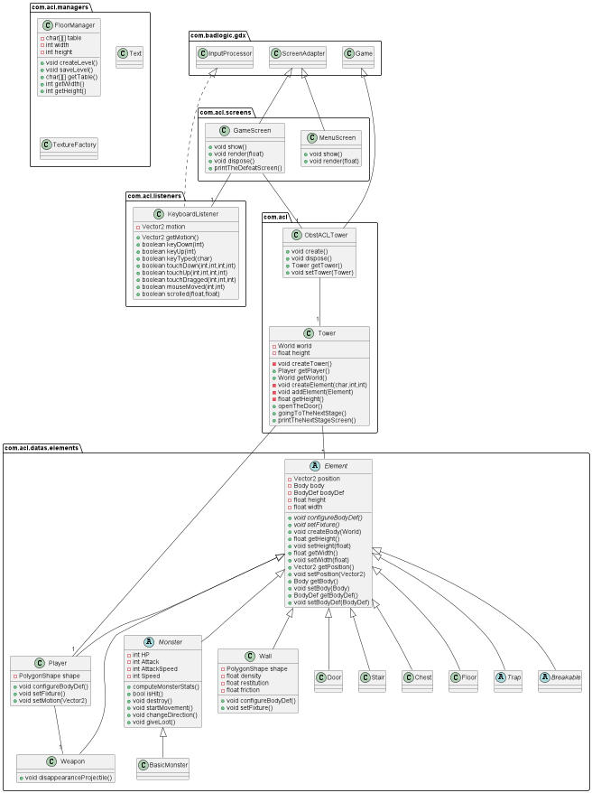
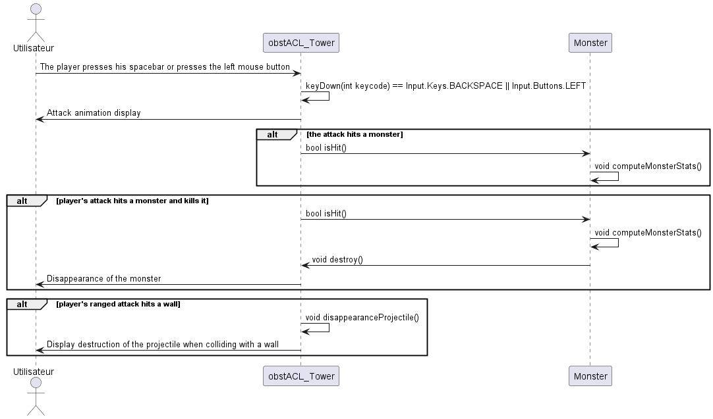
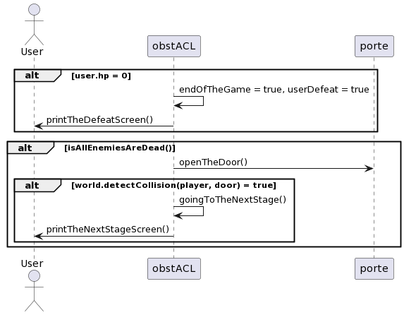
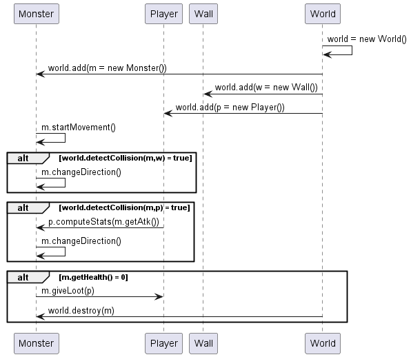
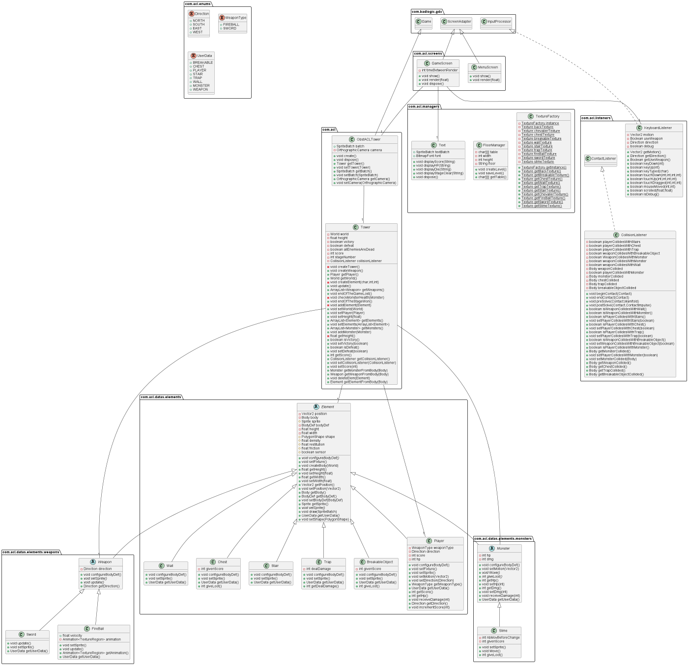

### Review

Nous avons rencontré quelques problèmes comme par exemple lors de l’affichage du texte, car la classe «
FreeTypeFontGenerator » était mal lié à gradle. Malgré ça, l’affichage est maintenant correct.

Nous avons réussi à mettre en place le système de monstres, actuellement, il n'y a qu'une sorte de monstre, le slime,
qui se déplace de manière aléatoire. L'implémentation des collisions s'est bien passée, en effet, les collisions sont
bien fonctionnelles et n'ont pas déclenché beaucoup de bugs, ce qui est en partie dû à notre choix d'utiliser des
hitboxs simples, des carrés en l'occurrence. La gestion de la mort des monstres et du loot a posé quelques problèmes, en
effet, les monstres étant stockés sous forme de liste, quelques petits bugs sont apparus avec la combinaison de parcours
et de suppression des monstres. La physique est maintenant corrigée pour le style de notre jeu (top-down) ce qui nous a
permis d'avoir un mouvement beaucoup plus fluide.

Nous avons également créé la classe abstract weapon, gérer l'attaque à distance qui est animé, et commencé la gestion de
l'attaque en mêlée. L’attaque blesse ainsi les monstres et permet de les tuer. La mise en place d'une animation pour l'
attaque de distance (la boule de feu) a posé beaucoup de problème à cause de la gestion des différentes textures, et du
découpage du spritessheet.

Des problèmes ont également été rencontrés pour la gestion des body des projectiles, qui devait avoir un "sensor"
différents pour ne pas déplacer les autres éléments du jeu tout en conservant le système de collision.

Des problèmes ont été rencontrés lors de la mise en place de la collision entre les différents éléments, mais de manière
générale, cela, c'est plutôt bien passé. La boucle de jeu a posé plus de problèmes : la mise en place de la pause et la
réactivation du jeu furent plus longues que prévu. L'affichage des différents textes d'informations sur l'écran de jeu
s'est plutôt bien passé, seule la gestion de leurs positions fût "problématique" et a nécessité de nombreux tests. Nous
avons décidé d'enlever l'élément porte, de cette manière, uniquement les escaliers permettent aux joueurs de monter
d'étages. Ceux-ci sont bloqués tant que le niveau n'est pas terminé. Nous avons changé la classe abstraite Trap en
classe Trap, nous avons choisi d'avoir uniquement un type de piège, de façon à simplifier l'expérience utilisateur.

### Restrospective

L'organisation de notre travail a été efficace à nouveau.  
L'ambiance au sein de l'équipe ne s'est pas dégradé et l'entraide est toujours très présente entre les différents
membres du groupe.  
Sur ce sprint, nous avons majoritairement travaillé en simultané, cela fût possible, car les fonctionnalités à
implémenter ne bloquaient pas l'implémentation des autres membres du groupe sauf dans certains cas.  
La charge de travail pour le deuxième sprint était suffisante, nous avons réussi à tout implémenter, mais en faire plus
aurait demandé plus de temps.  
La base de notre Jeu est donc complète ce qui nous permettra de travailler encore plus en simultané pour le sprint 

-----

## Sprint 2

### 
Backlogs

| Item                                          | Estimate |
|-----------------------------------------------|----------|
| Finaliser l'attaque de mêlée et son animation | 3        |
| Menu et pause                                 | 11       |
| Ajout d'étages                                | 8        |
| Amélioration des Hit-box                      | 5        |
| Ajout de monstres                             | 8        |

### 
Liste des tâches

| Responsable            | Tâches                                                                                                                                                        | Temps estimé               | Temps réel                 |
|------------------------|---------------------------------------------------------------------------------------------------------------------------------------------------------------|----------------------------|----------------------------|
| IOPETI Hugo            | Gestion de la pause la boucle de jeu.  Ajout d'étages.  Création/Amélioration des sprites (Boutons et flèche du menu, trapdoor, pièges).          | 3h  1h  1h     | 3h  1h30  1h   |
| MATHIEU STEINBACH Hugo | Attaque de mêlée et animation.  Ajout d'un monstre (Guardian).  Refonte de la boucle de l'affichage, et remaniement de certaines parties du code. | 1h30  1h30  2h | 1h30  1h30  2h |
| YVOZ Ludovic           | Gestion du menu pause.                                                                                                                                        | 5h                         | 5h30                       |
| ZIMOL Guillaume        | Changement des Hit-box.  Ajout d'un monstre (Crawler).                                                                                                  | 3h  2h               | 3h  2h               |

### Diagramme UML

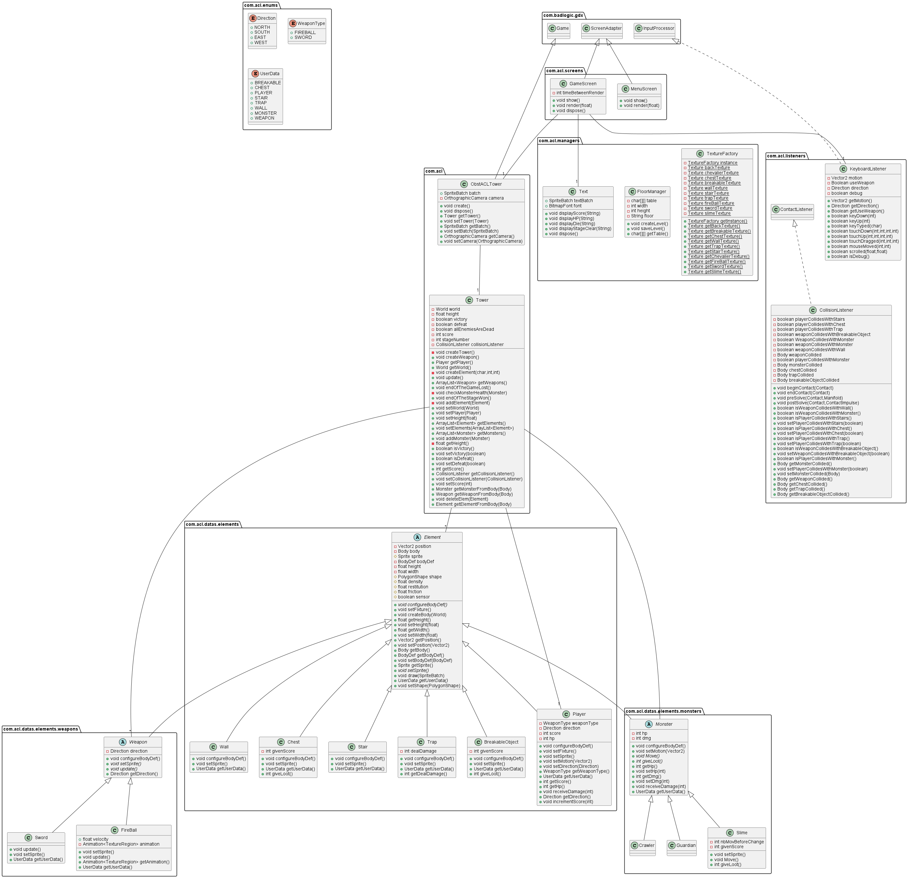
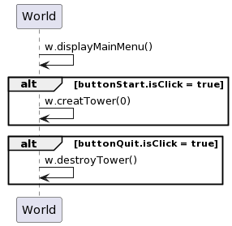
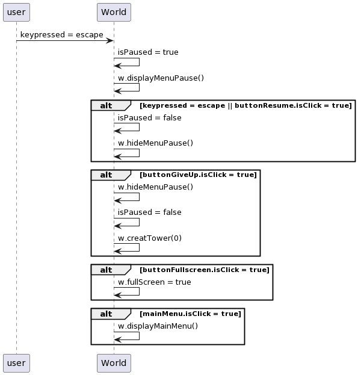
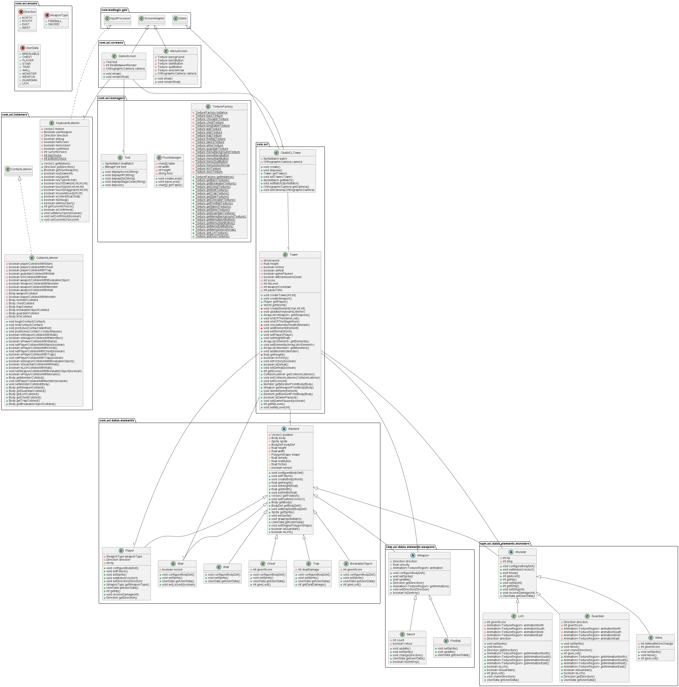

### Review

L'attaque de mêlée a été finalisée, et son animation complétée. 
Le monstre guardian qui se déplace verticalement ou horizontalement a été ajouté au jeu.
Des problèmes concernant la pause du jeu, ont été détectés en effet, de multiples modifications du monde, et plus généralement une partie de la boucle du jeu était en fait effectuée dans la boucle d'affichage. Tout a été revu et déplacé corrigeant ainsi les problèmes liés. 
La boucle de jeu a été implémentée correctement, sans trop de soucis. 
La pause et la reprise de la boucle de jeu ont été réalisées rapidement, et furent fonctionnelles après de nombreux tests. 
Deux étages ont été ajoutés, ayant une difficulté croissante. Tant qu'il existe des monstres à un étage, les escaliers sont inaccessibles par le joueur, une fois tout les montres tués, et l'étage fini, les escaliers sont libérés et empruntable par le joueur. 
Depuis le sprint précédant, des nouveaux sprites ont été ajoutés, ainsi que des anciens ont été améliorés. 
Un menu opérationnel ainsi que ces boutons ont été mis en place efficacement. 
Nous avons réussi à implémenter la menu de pause, mais cela à été assez compliqué, le passage d'un "écran" à un autre fut difficile à mettre en place à cause de la gestion des caméras, car la caméra de notre jeu est modifiée souvent, ce qui à posé pas mal de problèmes pour afficher l'image du menu de pause correctement. 
La pause de la boucle de jeu lors de l'affichage du menu de pause se fait automatiquement, avec notre implémentation, selon l'écran qui est affiché. 
Suite aux modifications évoquées précédemment, la pause de la boucle de jeu qui n'est désormais utilisé que pour la mort du joueur et pour le passage au prochain niveau. 
De grosses modifications ont été apportées à toutes les hitbox des éléments du jeu, pour bien plus s'adapter aux textures utilisées. 
Et pour finir, un nouveau monstre a encore été ajouté, il s'agit du Crawler qui se déplace en longeant les murs de la salle. 

Voici un comparatif des hitbox pour pouvoir visualiser le changement :
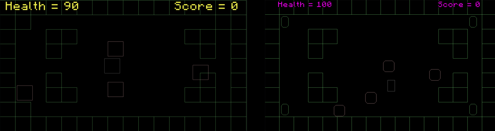

### Restrospective

L'ambiance ne s'est pas du tout détériorée au sein du groupe lors de ce sprint, l'entraide était de mise pour toutes les décisions importantes, surtout relatives au menu de pause et aux monstres. 
La charge de travail était encore mieux réparties pendant ce sprint, grâce aux sprints précédents, toutes les tâches étaient indépendantes les unes des autres, ce qui a permis de travailler en parallèle pendant la totalité du sprint. 
Comme pour chaque sprint, nous avons débuté les tâches que nous avions d'assigné dès le début du sprint. Ce qui nous laisse le temps de finaliser, de prendre connaissance et de tester le code de chacun des membres du groupe.

-----

## Sprint 3

### 
Backlogs

| Item                                                                      | Estimate |
|---------------------------------------------------------------------------|----------|
| Réparation de l'UI (plein écran).                                         | 3        |
| Ajout d'items (armes).                                                    | 8        |
| Ajouts des sons.                                                          | 8        |
| Animation de déplacement (joueur).                                        | 5        |
| Gérer la hauteur d'affichage (éléments, monstres).                        | 3        |
| Harmonisation du code (clean de la boucle du jeu, création de fonctions). | 5        |
| Ajouter des niveaux.                                                      | 3        |
| Revoir déplacements de la liche.                                          | 3        |

### 
Liste des tâches

| Responsable            | Tâches                                                                                                       | Temps estimé                     | Temps réel |
|------------------------|--------------------------------------------------------------------------------------------------------------|----------------------------------|------------|
| IOPETI Hugo            | Ajout de niveaux.  Implémentation des items.                                                           | 1h30  3h30                 |            |
| MATHIEU STEINBACH Hugo | Animation de déplacement.  Réparation de l'UI.  Changement d'arme.  Harmonisation du code. | 1h  1h  1h  2h |            |
| YVOZ Ludovic           | Gestion de la hauteur d'affichage.  Changement déplacement de la liche.  Ajouts des items.       | 1h  1h30  3h         |            |
| ZIMOL Guillaume        | Ajout d'une musique.  Ajout de sons.                                                                   | 2h  3h                     |            |

### Diagramme UML

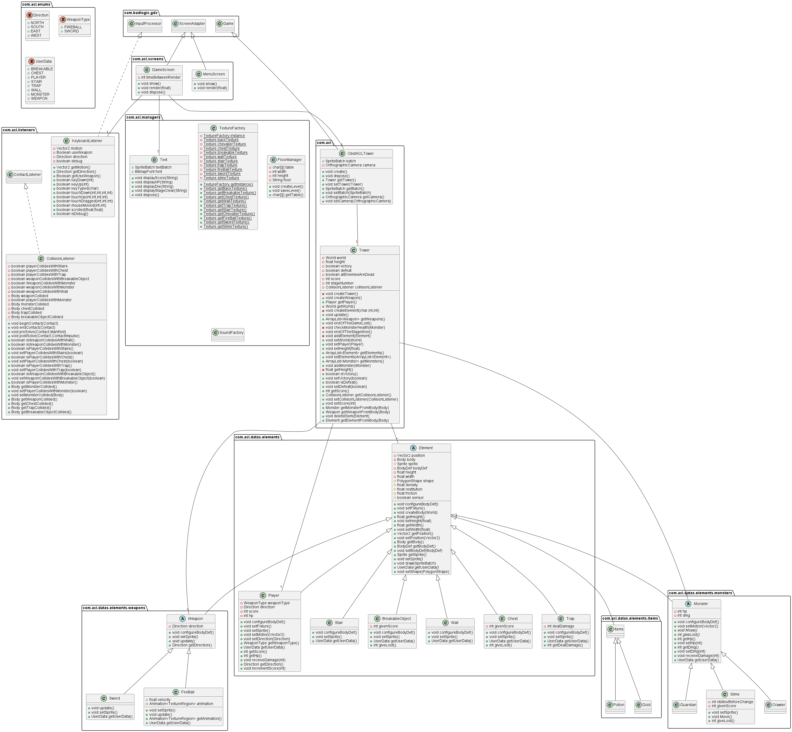
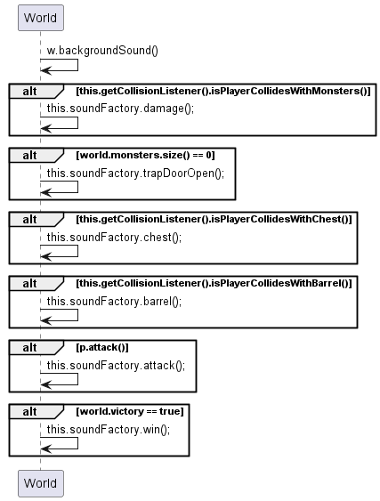
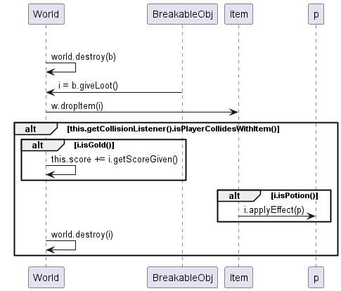

### Review

### Restrospective
